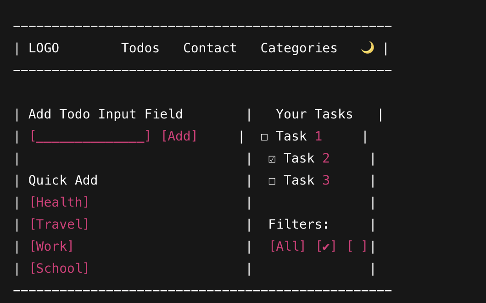
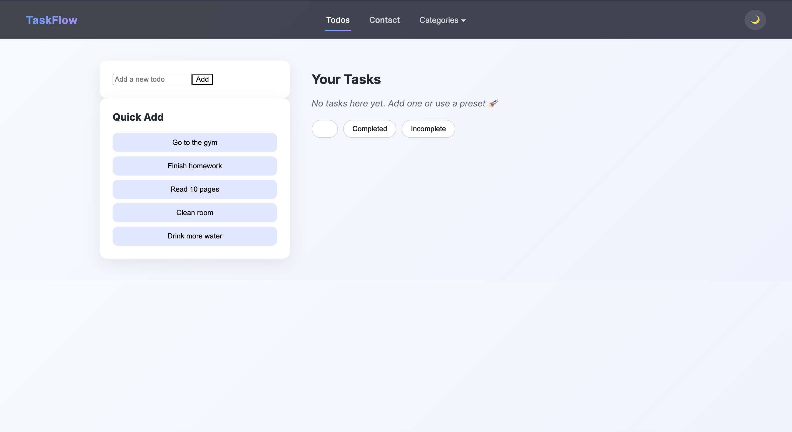
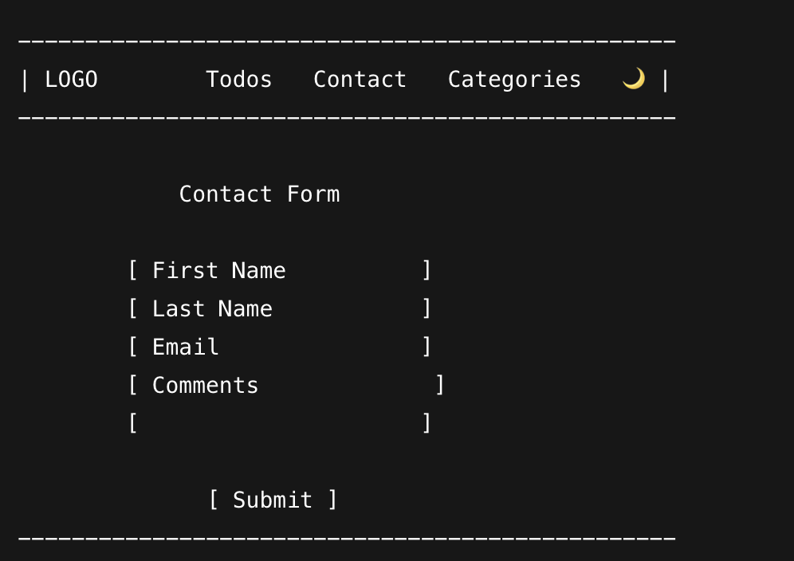
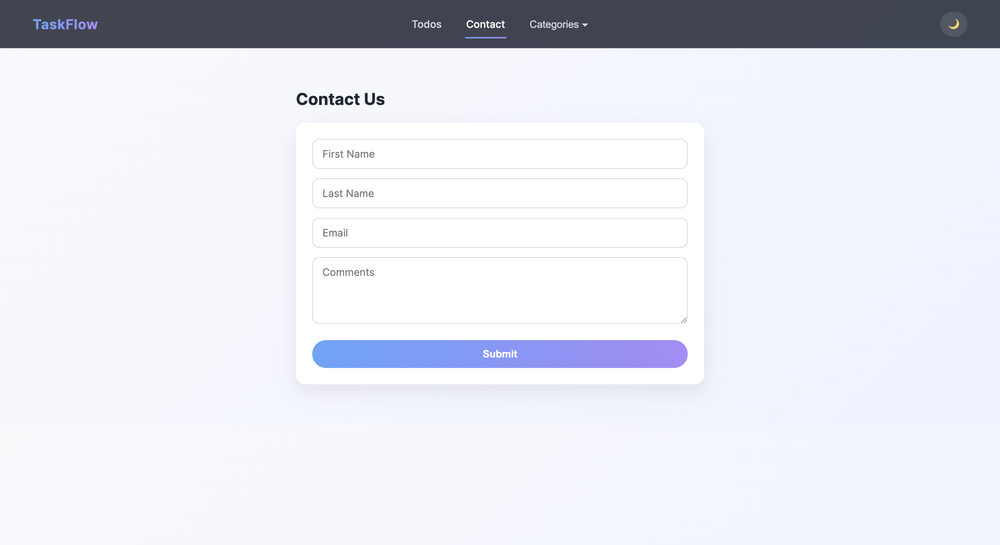
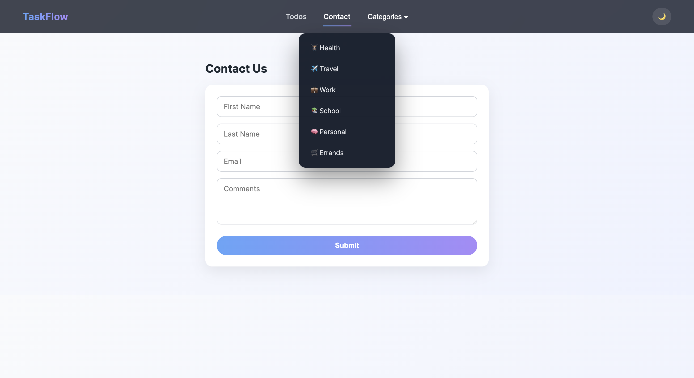
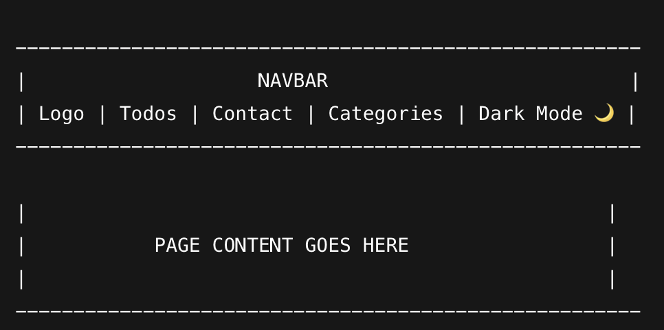

# 🗂️ TaskFlow – Task Management Web App

**Author:** Mohammed Adam

TaskFlow is a modern, responsive task management web application built with React. It allows users to create, update, delete, and organize tasks using filters, categories, and preset task bundles. The project focuses on clean UI, usability, and core CRUD functionality while demonstrating practical React concepts such as state management, controlled components, and component-based architecture.

---

## 🚀 Live Demo

https://mohammedadam275.github.io/task-manager/#/todos

---

## 📸 Screenshots

### Main Todos Page


### Alternative Todos View


### Contact Page


### Contact Page (Alt View)


### Categories Dropdown


### Navigation Bar


---

## 🛠️ Technologies Used

- React
- JavaScript (ES6+)
- HTML5
- CSS3
- React Hooks (`useState`)
- React Router (for navigation)

---

## ✨ Features

- Create, read, update, and delete tasks (CRUD)
- Mark tasks as completed or incomplete
- Filter tasks by:
  - All
  - Completed
  - Incomplete
- Category-based preset task bundles:
  - Health
  - Travel
  - Work
  - School
  - Personal
  - Errands
- Controlled contact form with validation
- Dark mode toggle
- Modern, responsive user interface

---

## 📖 User Stories

- As a user, I want to create, view, edit, and delete tasks so that I can manage my daily responsibilities efficiently.  
- As a user, I want to mark tasks as completed or incomplete so that I can track my progress.  
- As a user, I want to filter tasks by status (all, completed, incomplete) so that I can focus on what still needs to be done.  
- As a user, I want to use preset categories (Health, Work, School, etc.) so that I can quickly add common tasks.  
- As a user, I want to toggle dark mode so that I can use the app comfortably in different lighting conditions.  
- As a user, I want to fill out a contact form so that I can submit my information and comments through the application.

---

## 🧭 How to Use

1. Go to the **Todos** page to add and manage tasks  
2. Use the **input field** to add a custom task  
3. Use **Quick Add** buttons to insert preset tasks  
4. Mark tasks as **completed** or **incomplete**  
5. Use **filters** to switch between All / Completed / Incomplete  
6. Toggle **Dark Mode** using the moon icon  
7. Go to the **Contact** page and submit the form  

---

## 📌 Project Requirements Status

- [x] CRUD functionality for tasks  
- [x] Filters (All / Completed / Incomplete)  
- [x] Categories with preset tasks  
- [x] Dark mode toggle  
- [x] Contact form (controlled inputs)  
- [ ] Persist data with localStorage or backend (future improvement)

---

## 🔮 Future Improvements

1. Persist todos using `localStorage` or a backend API  
2. User authentication and personal accounts  
3. Drag-and-drop task reordering  
4. Due dates and reminders  
5. Task priority levels  
6. Search functionality for tasks  

---

## 🧱 Project Structure (Simplified)

```bash
src/
  components/
  pages/
  styles/
  App.js
  index.js
